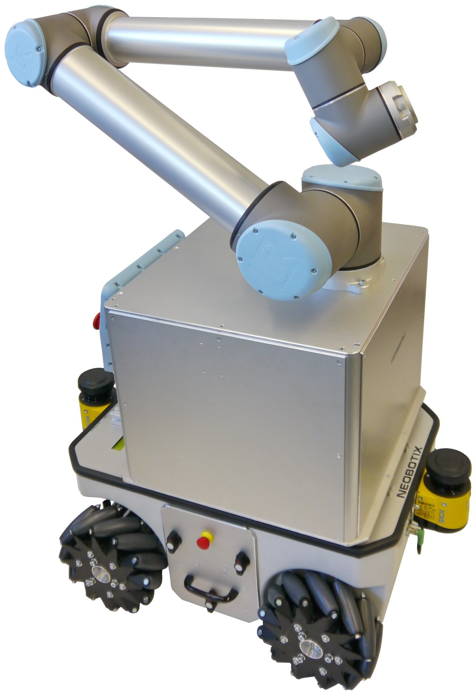

# ROS configuration and launch files for Neobotix MMO-500

This package contains configuration and launch files for Neobotix MMO-500.

  

The [MMO-500](https://www.neobotix-robots.com/mobile-manipulator-mmo-500.html) combines the omnidirectional robot MPO-500 with a light-weight robot arm from Universal Robots, Kuka, Rethink Robotics or Schunk.

Its Mecanum wheels allow the MMO-500 to move freely into any direction and thus to re-position the integrated arm very easily. This way the arm's workspace is significantly enlarged without having to deal with any constraints and kinematics problems.

The MMO-500 can integrate most of the available light weight arms. Due to its big footprint and high payload, the MMO-500 is also capable of carrying the big Universal Robots arm UR10 which can handle loads up to 10 kg.

The platform's movement can be controlled by the Robot Operating System (ROS).

# Documentation

Please find our documentations at https://docs.neobotix.de/

# Contact information

For more information please visit our website at www.neobotix-robots.com. 
If you have any questions, just get in touch with us:
* General information: http://www.neobotix-robots.com/company-contact.html
* ROS related questions: ros@neobotix.de

